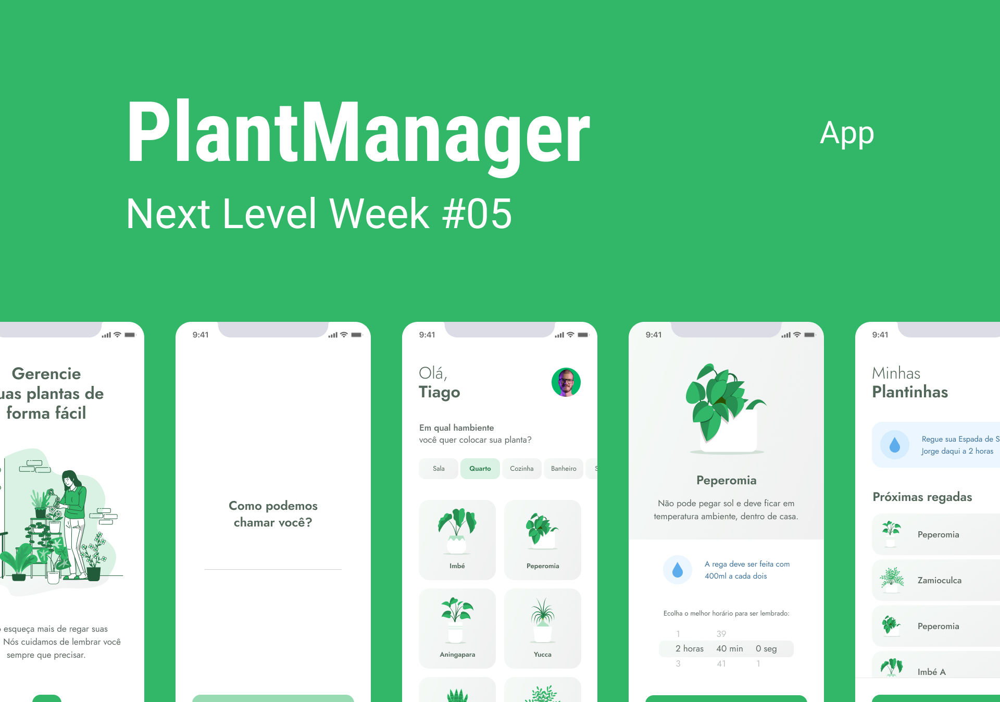

# Next Level Week 5 Rocketseat - React Native

A **Next Level Week** é um evento da **Rocketseat** de imersão em tecnologia. Onde é uma semana de aulas com conteúdos incríveis e uma comunidade bem massa de se fazer network. Nesse evento há diversas tecnologias, esta por exemplo é a trilha de **React Native**.

_#juntosparaoproximonivel_

## Proposta do projeto NLW5 React Native

A proposta deste NLW é desenvolver um app mobile para ajudar as pessoas a lembrar de cuidar de suas plantas, para isto será utilizado o `Expo`, `React Native`, `Typescript` e o `Axios`.

Projeto figma: [arquivo](./.github/PlantManager.fig)

## Conteúdo

**Dia 1**

O primeiro dia foi para explicar o quê é o `React Native` e o `Expo`, foi abordado sobre a criação de _componentes_ e criamos a primeira tela do app, a tela de _"Bem vindo"_.

**Dia 2**

O segundo dia foi para desenvolvemos mais duas telas, a de _"Confirmar nome"_ e _"Começar"_ e também criamos um _botão_ como _componente_ para ser utilizado no app.

**Dia 3**

O terceiro dia foi para desenvolvermos a tela de _"Escolha uma planta"_, também implemetamos o uso de uma api externa, no qual foi simulada pelo `json-server` e para fazer os `fetch's` da api foi utilizado o `Axios`.

**Dia 4**

O quarto e penúltimo dia foi bem intenso, de bastante conteúdo, hoje codamos bastante, fizemos a tela de listar as plantas salvas pelo usuário, definimos que a tela de confirmação ia ser um "componente" de tela onde iria ser utilizado tanto ao registrar um usuário, quando salvar um lembrete para uma planta, adicionamos também um `bottom bar` para navegação entre as telas de `PlantSelect` e `MyPlants`.

**Dia 5**

O último dia do evento, foi bem massa, a gente aplicou o sistema de notificações, tanto para android quanto para o ios com o `expo-notifications` e adicionamos a opção de deletar alguma planta registrada e com isso, finalizamos o projeto.

---

Agradecimento à **Rocketseat** 🚀 pelo evento incrível!💜

_Matheus Ishiyama_
